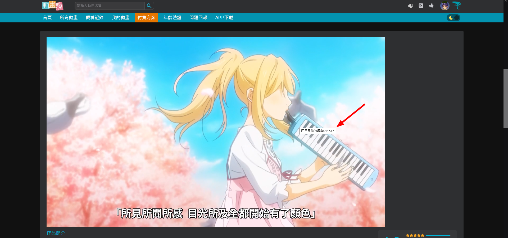

# baha-ani-butter-knife

[巴哈動畫瘋](https://ani.gamer.com.tw/)截圖附加元件

## 最低需求
* Firefox 90 或更新的版本

## 使用
安裝後，當進入動畫瘋時，附加元件就會自動注入網站中，並在動畫就緒開始播放後：

* 監聽鍵盤 <kbd>F8</kbd>
* 在播放控制介面右邊新增一個 <svg style="width:16px;height:16px" viewBox="0 0 24 24">
                <path fill="currentColor" d="M13.73,15L9.83,21.76C10.53,21.91 11.25,22 12,22C14.4,22 16.6,21.15 18.32,19.75L14.66,13.4M2.46,15C3.38,17.92 5.61,20.26 8.45,21.34L12.12,15M8.54,12L4.64,5.25C3,7 2,9.39 2,12C2,12.68 2.07,13.35 2.2,14H9.69M21.8,10H14.31L14.6,10.5L19.36,18.75C21,16.97 22,14.6 22,12C22,11.31 21.93,10.64 21.8,10M21.54,9C20.62,6.07 18.39,3.74 15.55,2.66L11.88,9M9.4,10.5L14.17,2.24C13.47,2.09 12.75,2 12,2C9.6,2 7.4,2.84 5.68,4.25L9.34,10.6L9.4,10.5Z" />
                </svg> 按鈕並監聽
* 在「作品簡介」區塊上方插入相簿區，作為截圖暫存區

一旦 <kbd>F8</kbd> 或播放控制介面按鈕被按下，都會觸發截圖。

觸發截圖事件後，附加元件會擷取目前影片畫面，並放置在相簿區（作品簡介上方）。

滑鼠放在圖片上方，會出現存檔名稱，預設為：動畫標題 + 集/話數資訊 + 時間（分 + 秒共四位）。例如圖，存檔名稱為「四月是你的謊言011515.png」：

在想儲存的圖片上點一下滑鼠左鍵，後續比照儲存 png 格式圖片的步驟進行；**所有未存檔圖片會在網頁重新整理後被清除**且無法還原，請在確認想儲存的圖片都存檔後再關閉分頁。

## 特別感謝
* [MDN](https://developer.mozilla.org)
* [w3schools](w3schools.com)
* <a target="_blank" href="https://icons8.com/icon/IfXJmG4pVtC9/butter">Butter</a> icon by <a target="_blank" href="https://icons8.com">Icons8</a>
* https://materialdesignicons.com/
* https://stackoverflow.com/a/61511955
* https://jsfiddle.net/onigetoc/v80khg1L/
* https://ithelp.ithome.com.tw/articles/10195264

## 聲明
本人撰寫附加元件僅供學術研究及程式碼練習，使用請遵守《著作權法》及[〈巴哈姆特動畫瘋服務條款〉](https://ani.gamer.com.tw/animeRule.php)等相關規範。

## LICENSE

Copyright © 2022 hms5232

本專案採用 [GNU AGPLv3](LICENSE) 開源許可證釋出

## donate 🎁
如果這個專案對你有幫助或覺得有用的話，請多支持動畫瘋和官方周邊；如果想贊助我個人的話，可以考慮贈送動畫瘋 VIP 序號給我，日後您的名字或許會有機會出現在贊助清單喔~

[>> 贊助序號表單請點我 <<](https://forms.gle/d6mvj4WtgXzgvdPb9)
